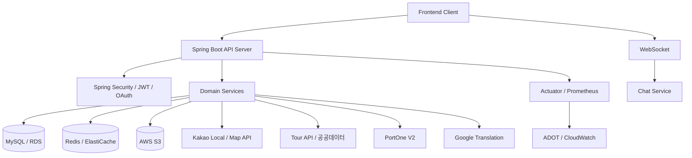

<div align="center">
  
  <h1>춘배투어 Chunbae Tour</h1>
  <p>
    여행지를 찾고, 동행을 만나고, 지역 상권과 연결되는<br />
    <b>지역 기반 여행 경험 통합 플랫폼</b>
  </p>
</div>

---

## 📅 1. 프로젝트 개요 & 개발 일정

춘배투어는 관광지와 축제, 전통시장 정보를 기반으로 사용자가 여행지를 탐색하고, 마음에 드는 장소를 저장하며, 동행 모집과 채팅을 통해 함께 여행할 사람을 만날 수 있도록 만든 서비스입니다.

지역 상권까지 연결해 전통시장, 가게, QR 결제, 엽전 지갑, 상품 주문 흐름을 제공하며, 관리자 기능을 통해 신고, 제재, 배너, 고객센터, 정산 심사 등 운영 업무도 함께 다룹니다.

| 구분 | 내용 |
| --- | --- |
| 프로젝트명 | 춘배투어 Chunbae Tour |
| 서비스 성격 | 여행 정보 탐색 + 동행 커뮤니티 + 지역 상권/결제 플랫폼 |
| 개발 형태 | 백엔드 / 프론트엔드 / 인프라 협업 프로젝트 |
| API 문서 | https://chunbae-tour-api.netlify.app/ |
| 운영 API | https://api.chunbae-tour.site |

## 🧭 2. 서비스 핵심 흐름

```text
여행지 탐색
  -> 관광지 / 축제 / 전통시장 검색
  -> 지도 마커와 내 주변 장소 확인
  -> 장소 상세, 리뷰, 찜

동행 경험
  -> 동행 게시글 작성
  -> 참여 요청
  -> 채팅
  -> 동행 리뷰
  -> 알림 수신

지역 상권 연결
  -> 전통시장 / 가게 조회
  -> 메뉴와 공지 확인
  -> QR 결제
  -> 엽전 지갑 / 상품 주문

운영 관리
  -> 신고 / 제재
  -> 배너 / FAQ / 고객센터
  -> 정산 / 환불 / 광고 심사
  -> 번역 / 알림 / 감사 로그 관리
```

## 🧩 3. 주요 기능

| 영역 | 기능 |
| --- | --- |
| 회원 / 인증 | 회원가입, 로그인, OAuth(Kakao/Naver), JWT 재발급, 권한 분리 |
| 마이페이지 | 내 정보, 프로필 이미지, 내가 쓴 리뷰, 내 찜 목록, 회원 탈퇴 |
| 관광지 / 지도 | 관광지 목록/상세, 지도 마커, 주변 관광지, 주변 맛집/상점, 길찾기 |
| 검색 | 통합 검색, 장소/축제 검색, 자동완성, 오타 교정, 인기/최근 검색어 |
| 찜 / 리뷰 | 관광지/축제/전통시장 찜, 관광지 리뷰, 마이페이지 통합 조회 |
| 축제 / 전통시장 | 축제 목록/상세/달력, 전통시장 주변 조회/상세, 공공데이터 동기화 |
| 커뮤니티 / 동행 | 자유/동행 게시글, 댓글/대댓글, 동행 모집, 참여 요청, 동행 리뷰 |
| 파일 / 이미지 | 프로필 이미지, 게시글 이미지, 채팅 파일, 상담 파일, 가게 이미지 업로드 |
| 채팅 | WebSocket 채팅방, 메시지, 채팅 파일 업로드, 참여 요청 승인/거절 |
| 알림 | 사용자 알림 생성, 읽음 처리, 서비스 이벤트 알림 |
| 번역 | 채팅/콘텐츠 번역, 번역 캐시, Google Translation API 연동 |
| 상인 / 가게 | 입점 신청, 상인 OAuth/로그인, 가게 관리, 메뉴, 공지, 이미지, 정산, 광고 |
| 상인 인증 / 심사 | 상점 인증 신청 검토, 입점 신청 승인/거절, 광고 심사 |
| 스토어 / 아이템 | 상품 목록/상세, 상품 주문, 내 아이템, 아이템 QR |
| 결제 / 엽전 | 충전, 취소, 환불, QR 결제, 결제 웹훅, 엽전 잔액/거래내역 |
| 신고 / 제재 | 콘텐츠 신고, 사용자 신고, 제재 처리, 신고 상태 관리 |
| 고객센터 / 배너 | FAQ, FAQ 번역, 1:1 상담방, 상담 메시지/파일, 배너 노출 |
| 관리자 | 사용자 관리, 신고/제재, 환불/정산/광고 심사, 감사 로그, 대시보드 |
| 운영 배치 / 안정성 | 데이터 동기화, 환불 재시도, S3 고아 파일 정리, Rate Limit, 분산 락 |

## 🏗️ 4. 시스템 구성



## 🛠️ 5. 기술 스택

| 구분 | 기술 |
| --- | --- |
| Backend | Java 21, Spring Boot 4, Spring Web MVC |
| Security | Spring Security, JWT, OAuth(Kakao/Naver) |
| Database | MySQL, Spring Data JPA, Hibernate Spatial, QueryDSL, Flyway |
| API Docs | Springdoc OpenAPI / Swagger UI |
| Validation | Bean Validation |
| Redis | Redis, Redisson, ZSet, List, Geo, Pub/Sub, Distributed Lock |
| Realtime | Spring WebSocket |
| File Storage | AWS S3, Presigned URL |
| File Validation | Apache Tika, Apache POI, magic-byte validation |
| Scheduler | Spring Scheduler, ShedLock |
| Infra | Docker, AWS ECR, ECS Fargate, ALB, RDS, ElastiCache, AWS Secrets Manager |
| Monitoring / Logging | Actuator, Micrometer, Prometheus, ADOT, CloudWatch, Logstash JSON Encoder |
| Audit / AOP | Spring AOP, AspectJ, 관리자 감사 로그 |
| Test | JUnit 5, Spring Boot Test, Testcontainers |
| External | Kakao API, Tour API, 공공데이터포털, PortOne V2, Google Translation API, Apache HttpClient |

## 🔎 6. 도메인 구성

| 도메인 | 설명 |
| --- | --- |
| Admin | 관리자 대시보드, 감사 로그, 운영 심사 |
| Auth / User | 로그인, OAuth, JWT, 마이페이지, 권한 |
| Banner | 배너 노출과 운영 관리 |
| Chat | WebSocket 채팅, 채팅방, 메시지, 파일 업로드 |
| Common | 공통 응답, 예외, 설정, Redis, S3, Rate Limit |
| Community | 자유/동행 게시글, 댓글, 이미지 |
| Companion Review | 동행 참여, 동행 종료, 동행 리뷰 |
| CS | FAQ, 1:1 상담, 고객센터 |
| Festival | 축제 목록/상세/달력, 축제 데이터 동기화 |
| Like | 관광지/축제/전통시장 공통 찜 |
| Market | 전통시장 위치 기반 조회, 상세, 데이터 동기화 |
| Merchant | 상인 입점 신청 |
| Notification | 사용자 알림, 읽음 처리 |
| Payment | 충전, 취소, 환불, QR 결제, 웹훅 |
| Place | 관광지, 지도, 추천, 리뷰, 카카오 API |
| Report | 신고, 제재, 신고 처리 |
| Search | 통합 검색, 장소/축제 검색, 자동완성, 인기/최근 검색어, 오타 교정 |
| Shop | 가게, 메뉴, 공지, 이미지, 정산, 광고, QR |
| Store | 상품, 주문, 아이템 |
| Translation | 번역, 번역 캐시, 외부 번역 API 연동 |
| Yeopjeon | 엽전 지갑, 잔액, 거래내역 |

## 🚀 7. 배포와 운영

```text
Pull Request
  -> GitHub Actions CI
  -> build / compileTestJava / test

main merge
  -> Docker image build
  -> ECR push
  -> ECS Fargate rolling deployment
  -> ALB health check
```

- `main` 브랜치 머지 시 운영 ECS 서비스로 자동 배포됩니다.
- 배포 실패 시 ECS circuit breaker를 통해 이전 버전으로 롤백됩니다.
- 운영 Secret은 AWS Secrets Manager를 통해 주입합니다.
- Actuator와 Prometheus 메트릭을 통해 상태와 지표를 확인합니다.

## 🧯 8. 트러블슈팅

프로젝트 진행 중 발생한 주요 트러블슈팅은 Notion에 정리했습니다.

- 트러블슈팅 모음: https://www.notion.so/teamsparta/4b32dc3ef5148399a51a01ca625b2095?source=copy_link#3822dc3ef51480ba9791f8142c8537f9

## 🤖 9. AI 협업 개발 방식

춘배투어는 개발 전 과정에서 목적에 맞게 AI 도구를 나누어 활용했습니다. AI가 제안한 내용을 그대로 적용하지 않고, 공식 문서와 코드 리뷰를 통해 검증한 뒤 실제 코드에 반영했습니다.

| 단계 | 도구 | 활용 내용 |
| --- | --- | --- |
| 설계 | Claude | 시스템 아키텍처 검토, ERD 구조 점검, 도메인 간 의존관계 정리 |
| 백엔드 개발 | Google Antigravity, Claude Code, Codex | 기능 구현 초안 작성, 오류 원인 분석, Redis/JPA/QueryDSL 디버깅 |
| 프론트엔드 개발 | Codex | 컴포넌트 구현 보조, API 연동 흐름 점검, 화면 테스트 체크리스트 정리 |
| 리뷰 / 품질 | CodeRabbit, Codex, Claude Code | PR 리뷰 보조, 테스트 누락 확인, 운영 리스크 점검 |
| 문서화 | Claude, ChatGPT | README, API 테스트 체크리스트, 발표 자료 초안 정리 |

### AI 사용 원칙

- AI가 제안한 코드는 반드시 이해한 뒤 적용했습니다.
- 동작 원리를 설명할 수 없는 코드는 머지하지 않는 것을 원칙으로 삼았습니다.
- Spring, Redis, AWS, PortOne 등 공식 문서와 교차 검증한 뒤 실제 코드에 반영했습니다.
- AI 답변이 서로 충돌하거나 확신이 낮은 경우 팀원, 튜터, PR 리뷰를 통해 최종 결정을 내렸습니다.
- 운영 데이터에 영향을 줄 수 있는 변경은 테스트와 리뷰를 거쳐 반영했습니다.

### 프로젝트 적용 예시

Redis Cluster 전환 과정에서 `RENAME`, `MGET` 같은 multi-key 명령이 CROSSSLOT 오류를 만들 수 있다는 점을 AI 리뷰와 팀 공유를 통해 확인했습니다. 이후 Redis hash tag, 개별 GET/파이프라인 전략, dirty marker 유실 방지 로직을 코드와 테스트로 보강했습니다.

관광지 조회수/좋아요 write-behind 구조를 만들 때는 Redis counter와 dirty set을 함께 사용하되, 동기화 중 값이 바뀐 경우 dirty marker를 남겨 다음 배치에서 재처리하도록 설계했습니다. AI 제안은 설계 후보로 활용하고, 최종 구현은 코드 리뷰와 테스트를 기준으로 확정했습니다.

## 👥 10. 팀원 소개

| 팀원 | 담당 영역 |
| --- | --- |
| 임하은 | 매칭, 채팅, 알림, 번역, CS, QA |
| 정민교 | 회원, 인증, 마이페이지, 관리자, 배포 |
| 신현민 | 스토어, 결제, 상인, 운영, 프론트엔드 |
| 박경화 | 커뮤니티, 신고, 축제 캘린더, 발표 |
| 김인목 | 지도 및 길찾기, 관광지, 검색, 찜, QA |

---

<div align="center">
  <b>즐거운 여행, 춘배와 함께!</b>
</div>
