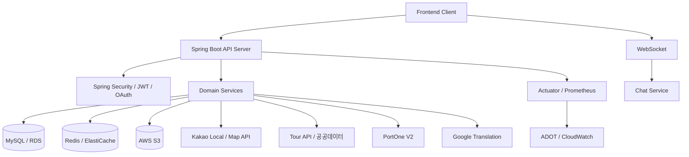

<div align="center">
  

  <h1>🌸 춘배투어 Chunbae Tour</h1>

  <p>
    여행지를 찾고, 동행을 만나고, 지역 상권과 연결되는<br/>
    <b>지역 기반 여행 경험 통합 플랫폼</b>
  </p>

  <p>
    
    
    
    
    
  </p>

  <p>
    <a href="https://chunbae-tour-api.netlify.app/">📄 API 문서</a> &nbsp;|&nbsp;
    <a href="https://api.chunbae-tour.site">🌐 운영 API</a> &nbsp;|&nbsp;
    <a href="https://www.notion.so/teamsparta/4b32dc3ef5148399a51a01ca625b2095">🧯 트러블슈팅</a>
  </p>
</div>

---

## 📌 목차

1. [프로젝트 개요](#1-프로젝트-개요)
2. [팀원 소개](#2-팀원-소개)
3. [기술 스택](#3-기술-스택)
4. [시스템 아키텍처](#4-시스템-아키텍처)
5. [서비스 흐름](#5-서비스-흐름)
6. [도메인 구성](#6-도메인-구성)
7. [주요 기능](#7-주요-기능)
8. [배포 파이프라인](#8-배포-파이프라인)
9. [트러블슈팅](#9-트러블슈팅)
10. [AI 협업 방식](#10-ai-협업-방식)

---

## 1. 프로젝트 개요

춘배투어는 관광지·축제·전통시장 정보를 기반으로 여행지 탐색, 동행 모집, 지역 상권 연결까지 하나의 서비스로 제공하는 플랫폼입니다.
QR 결제, 엽전 지갑, 상품 주문 흐름을 갖추고, 관리자 기능으로 신고·제재·정산·고객센터 등 운영 업무까지 커버합니다.

| 항목 | 내용 |
|---|---|
| 서비스 성격 | 여행 정보 탐색 + 동행 커뮤니티 + 지역 상권·결제 |
| 개발 형태 | 백엔드 / 프론트엔드 / 인프라 협업 |
| 개발 기간 | 2025.12 – 2026.06 |

---

## 2. 팀원 소개

| 이름 | 담당 도메인 |
|---|---|
| 임하은 | 동행 매칭, 채팅, 알림, 번역, CS, QA |
| 정민교 | 회원, 인증, 마이페이지, 관리자, 배포 |
| 신현민 | 스토어, 결제, 상인, 운영, 프론트엔드 |
| 박경화 | 커뮤니티, 신고, 축제 캘린더, 발표 |
| 김인목 | 지도·길찾기, 관광지, 검색, 찜, QA |

---

## 3. 기술 스택

| 분류 | 기술 |
|---|---|
| **Language / Framework** | Java 21, Spring Boot 4, Spring Web MVC |
| **Security** | Spring Security, JWT, OAuth 2.0 (Kakao / Naver) |
| **Database** | MySQL, JPA / Hibernate Spatial, QueryDSL, Flyway |
| **Redis** | Redisson, ZSet, Geo, Pub/Sub, Distributed Lock |
| **Realtime** | Spring WebSocket |
| **File Storage** | AWS S3, Presigned URL, Apache Tika / POI |
| **Scheduler** | Spring Scheduler, ShedLock |
| **Infra** | Docker, ECR, ECS Fargate, ALB, RDS, ElastiCache, Secrets Manager |
| **Monitoring** | Actuator, Micrometer, Prometheus, ADOT, CloudWatch, Logstash |
| **Test** | JUnit 5, Spring Boot Test, Testcontainers |
| **External API** | Kakao API, 공공데이터(Tour API), PortOne V2, Google Translation |

---

## 4. 시스템 아키텍처



---

## 5. 서비스 흐름

```
🗺️  여행지 탐색
    관광지 / 축제 / 전통시장 검색 → 지도 마커 & 내 주변 장소 → 상세 / 리뷰 / 찜

🤝  동행 경험
    동행 게시글 작성 → 참여 요청 → 채팅 → 동행 리뷰 → 알림 수신

🛒  지역 상권 연결
    전통시장 / 가게 조회 → 메뉴 & 공지 확인 → QR 결제 → 엽전 지갑 / 상품 주문

🔧  운영 관리
    신고 / 제재 → 배너 / FAQ / 고객센터 → 정산 / 환불 / 광고 심사 → 감사 로그
```

---

## 6. 도메인 구성

<details>
<summary>전체 도메인 펼치기</summary>

| 도메인 | 설명 |
|---|---|
| Admin | 관리자 대시보드, 감사 로그, 운영 심사 |
| Auth / User | 로그인, OAuth, JWT, 마이페이지, 권한 |
| Banner | 배너 노출·운영 관리 |
| Chat | WebSocket 채팅방, 메시지, 파일 업로드 |
| Common | 공통 응답, 예외, 설정, Redis, S3, Rate Limit |
| Community | 자유/동행 게시글, 댓글 |
| Companion Review | 동행 참여, 종료, 리뷰 |
| CS | FAQ, 1:1 상담 |
| Festival | 축제 목록/상세/달력, 데이터 동기화 |
| Like | 관광지/축제/전통시장 찜 |
| Market | 전통시장 위치 기반 조회·상세 |
| Merchant | 상인 입점 신청 |
| Notification | 사용자 알림, 읽음 처리 |
| Payment | 충전, 취소, 환불, QR 결제, 웹훅 |
| Place | 관광지, 지도, 추천, 리뷰, Kakao API |
| Report | 신고, 제재, 신고 처리 |
| Search | 통합 검색, 자동완성, 오타 교정, 인기/최근 검색어 |
| Shop | 가게, 메뉴, 공지, 정산, 광고, QR |
| Store | 상품, 주문, 아이템 |
| Translation | 번역, 번역 캐시, 외부 API 연동 |
| Yeopjeon | 엽전 지갑, 잔액, 거래내역 |

</details>

---

## 7. 주요 기능

| 영역 | 기능 요약 |
|---|---|
| 회원·인증 | 회원가입, 로그인, OAuth(Kakao/Naver), JWT 재발급, 권한 분리 |
| 관광지·지도 | 목록·상세, 지도 마커, 주변 장소, 길찾기 |
| 검색 | 통합 검색, 자동완성, 오타 교정, 인기·최근 검색어 |
| 찜·리뷰 | 관광지·축제·전통시장 찜, 리뷰 작성, 마이페이지 통합 조회 |
| 축제·전통시장 | 목록·상세·달력, 공공데이터 동기화 |
| 동행·커뮤니티 | 게시글·댓글, 동행 모집, 참여 요청, 동행 리뷰 |
| 채팅 | WebSocket 채팅방·메시지, 파일 업로드, 참여 요청 승인·거절 |
| 알림 | 이벤트 알림, 읽음 처리 |
| 번역 | 채팅·콘텐츠 번역, 번역 캐시, Google Translation 연동 |
| 결제·엽전 | 충전·취소·환불, QR 결제, 웹훅, 엽전 지갑 |
| 상인·가게 | 입점 신청, 가게·메뉴·공지 관리, 정산·광고 |
| 관리자 | 사용자·신고·제재 관리, 정산·광고 심사, 감사 로그, 대시보드 |
| 운영 안정성 | 데이터 동기화, 환불 재시도, S3 고아 파일 정리, Rate Limit, 분산 락 |

---

## 8. 배포 파이프라인

```
Pull Request
  └─ GitHub Actions CI → build / compileTestJava / test

main merge
  └─ Docker image build
       └─ ECR push
            └─ ECS Fargate rolling deployment
                 └─ ALB health check (실패 시 ECS circuit breaker로 롤백)
```

- 운영 Secret은 **AWS Secrets Manager** 주입
- **Actuator + Prometheus** 메트릭으로 상태·지표 모니터링

---

## 9. 트러블슈팅

프로젝트 진행 중 발생한 주요 트러블슈팅은 Notion에 정리했습니다.

👉 [트러블슈팅 모음 보기](https://www.notion.so/teamsparta/4b32dc3ef5148399a51a01ca625b2095?source=copy_link#3822dc3ef51480ba9791f8142c8537f9)

---

## 10. AI 협업 방식

개발 전 과정에서 목적에 맞게 AI 도구를 나누어 활용했습니다.
AI 제안은 공식 문서·코드 리뷰로 검증한 뒤 실제 코드에 반영했습니다.

| 단계 | 도구 | 활용 |
|---|---|---|
| 설계 | Claude | 아키텍처 검토, ERD 점검, 도메인 의존관계 정리 |
| 백엔드 개발 | Google Antigravity · Claude Code · Codex | 기능 구현 초안, 오류 분석, Redis/JPA/QueryDSL 디버깅 |
| 프론트엔드 개발 | Codex | 컴포넌트 구현 보조, API 연동 흐름 점검 |
| 리뷰·품질 | CodeRabbit · Codex · Claude Code | PR 리뷰 보조, 테스트 누락 확인, 운영 리스크 점검 |
| 문서화 | Claude · ChatGPT | README, 발표 자료 초안 정리 |

### 사용 원칙

- AI가 제안한 코드는 반드시 이해한 뒤 적용했습니다.
- 동작 원리를 설명할 수 없는 코드는 머지하지 않는 것을 원칙으로 삼았습니다.
- Spring, Redis, AWS, PortOne 등 공식 문서와 교차 검증한 뒤 실제 코드에 반영했습니다.
- AI 답변이 서로 충돌하거나 확신이 낮은 경우 팀원·튜터·PR 리뷰를 통해 최종 결정을 내렸습니다.
- 운영 데이터에 영향을 줄 수 있는 변경은 테스트와 리뷰를 거쳐 반영했습니다.

<details>
<summary>적용 사례 보기</summary>

**Redis Cluster 전환**
`RENAME`, `MGET` 같은 multi-key 명령의 CROSSSLOT 오류 가능성을 AI 리뷰와 팀 공유로 확인 후,
Redis hash tag · 개별 GET/파이프라인 전략 · dirty marker 유실 방지 로직을 코드와 테스트로 보강했습니다.

**관광지 write-behind 구조**
Redis counter + dirty set을 함께 사용하되, 동기화 중 값이 변경된 경우 dirty marker를 남겨 다음 배치에서 재처리하도록 설계했습니다.

</details>

---

<div align="center">
  <b>즐거운 여행, 춘배와 함께! 🌸</b>
</div>
