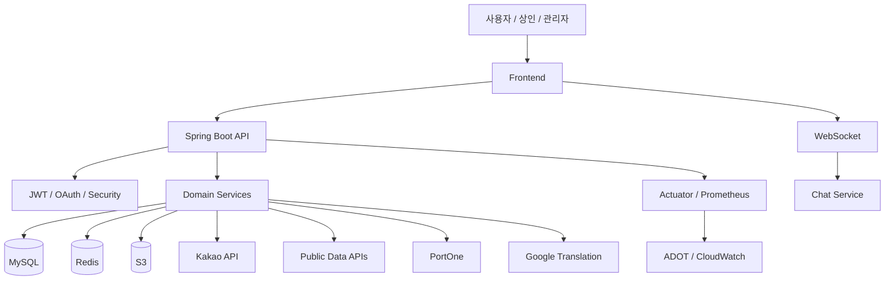

# 춘배투어 Chunbae Tour

춘배투어는 여행지를 찾는 순간부터 동행을 만나고, 지역 상점을 이용하고, 결제 이후의 마이페이지 관리까지 이어지는 여행 경험을 다루는 백엔드 프로젝트입니다.

사용자는 관광지와 축제, 전통시장을 검색하고 지도에서 주변 정보를 확인합니다. 마음에 드는 장소는 찜해두고, 동행 게시글과 채팅으로 함께 갈 사람을 찾을 수 있습니다. 지역 상점은 메뉴, 공지, QR 결제, 정산 기능으로 서비스 안에 연결됩니다.

## 한눈에 보기

| 항목 | 내용 |
| --- | --- |
| 서비스 성격 | 여행 정보 탐색 + 동행 커뮤니티 + 지역 상권/결제 플랫폼 |
| 백엔드 역할 | REST API, WebSocket, 인증/인가, 검색/지도, 결제, 운영 관리 |
| 운영 환경 | AWS ECS Fargate, RDS MySQL, ElastiCache Redis, S3 |
| API 문서 | https://chunbae-tour-api.netlify.app/ |
| 주요 기술 | Spring Boot 4, Java 21, JPA, QueryDSL, Redis, Flyway, WebSocket |

## 사용자가 경험하는 흐름

```text
1. 여행지를 찾는다
   - 통합 검색, 관광지 검색, 축제 검색, 자동완성, 오타 교정

2. 지도에서 주변을 본다
   - 관광지 마커, 내 주변 관광지, 주변 맛집/상점, 길찾기

3. 마음에 드는 대상을 저장한다
   - 관광지/축제/전통시장 찜, 마이페이지 찜 목록

4. 같이 갈 사람을 찾는다
   - 동행 게시글, 참여 신청, 채팅, 동행 리뷰

5. 지역 상점을 이용한다
   - 가게 정보, 메뉴, 공지, QR 결제, 엽전

6. 서비스 운영자가 관리한다
   - 신고, 제재, 배너, FAQ, 고객센터, 관리자 대시보드
```

## 백엔드가 해결하는 문제

### 빠른 탐색

관광 서비스에서는 사용자가 검색어를 입력하거나 지도를 움직일 때 즉각적인 응답이 중요합니다. 춘배투어는 MySQL Full-Text Index, QueryDSL 동적 쿼리, Redis 캐시, Redis Geo를 조합해 검색과 지도 조회를 처리합니다.

### 실시간 반응

최근 검색어, 인기 검색어, 채팅, 알림, 조회수/좋아요 통계는 사용자의 행동과 함께 계속 변합니다. Redis List/ZSet/PubSub/Counter를 각각의 목적에 맞게 사용해 실시간성과 DB 부하 절감을 함께 가져갑니다.

### 운영 가능한 데이터 변경

공공데이터 동기화, 리뷰/찜/결제/정산처럼 데이터 정합성이 중요한 기능이 많습니다. Flyway로 DB 변경 이력을 관리하고, JPA 트랜잭션과 스케줄러 잠금으로 운영 환경에서의 안정성을 확보합니다.

### 역할별 권한 분리

일반 사용자, 상인, 관리자 권한이 다릅니다. Spring Security와 JWT를 기반으로 API 접근 권한을 분리하고, 관리자 작업은 감사 로그로 추적할 수 있게 구성했습니다.

## 서비스 영역

### 여행 탐색

- 관광지 목록/상세
- 지도 마커 조회
- 내 주변 관광지 조회
- 주변 관광지/상점 추천
- Kakao 지오코딩, 리버스 지오코딩, 길찾기
- 홈 추천 관광지

### 검색 경험

- 통합 검색
- 관광지/축제 검색
- 자동완성
- 오타 교정
- 최근 검색어
- 인기 검색어
- 내부 선택용 검색 집계 제외 정책

### 사용자 활동

- 관광지/축제/전통시장 찜
- 관광지 리뷰
- 마이페이지 홈
- 내 찜 목록
- 내 리뷰 목록
- 프로필 이미지 업로드

### 커뮤니티와 동행

- 자유 게시글
- 동행 게시글
- 댓글/대댓글
- 채팅방
- 참여 신청
- 동행 생성/종료
- 동행 리뷰

### 지역 상권

- 전통시장 조회/상세
- 가게 공개 정보
- 상인 입점 신청
- 내 가게 관리
- 메뉴/공지/이미지
- 광고 신청
- 정산 계좌/가게 지갑/정산 신청

### 결제와 엽전

- PortOne 충전
- 결제 취소
- 환불
- QR 결제
- 엽전 잔액
- 엽전 거래내역
- 상품 주문
- 사용자 아이템

### 운영 관리

- 관리자 대시보드
- 사용자 제재
- 신고 처리
- 배너 관리
- FAQ/고객센터
- 알림
- 번역 캐시
- 관리자 감사 로그

## 기술 구성

### 애플리케이션

| 구분 | 기술 |
| --- | --- |
| 언어 | Java 21 |
| 프레임워크 | Spring Boot 4.0.6 |
| API | Spring Web MVC |
| 실시간 통신 | Spring WebSocket |
| 인증/인가 | Spring Security, JWT, OAuth(Kakao/Naver) |
| 데이터 접근 | Spring Data JPA, QueryDSL |
| DB 마이그레이션 | Flyway |

### 데이터와 인프라

| 구분 | 기술 |
| --- | --- |
| RDB | MySQL (local: 8.4, prod: RDS MySQL) |
| 캐시/랭킹/락 | Redis (local: 7, prod: ElastiCache), Redisson |
| 스케줄러 락 | ShedLock |
| 파일 저장 | AWS S3 |
| 배포 | Docker, AWS ECR, ECS Fargate, ALB |
| Secret | AWS Secrets Manager |
| 모니터링 | Actuator, Micrometer Prometheus, ADOT, CloudWatch |
| 테스트 | JUnit 5, Spring Boot Test, Testcontainers |

### 외부 연동

| 연동 | 사용 기능 |
| --- | --- |
| Kakao Local API | 주소 검색, 좌표 변환, 주변 상점 검색 |
| Kakao Map Link | 길찾기 URL 생성 |
| 한국관광공사 Tour API | 관광지 데이터 동기화 |
| 공공데이터포털 | 축제/전통시장 데이터 동기화 |
| PortOne V2 | 충전, 취소, 환불, QR 결제 |
| Google Translation API | 번역 |

## 시스템 연결 구조



## API 문서

전체 API 명세는 아래 문서에서 확인합니다.

- API 명세서: https://chunbae-tour-api.netlify.app/
- 운영 API Base URL: `https://api.chunbae-tour.site`
- 로컬 API Base URL: `http://localhost:8080`

운영 환경에서는 Swagger UI와 API Docs가 비활성화되어 있습니다.

## 대표 API 그룹

| 영역 | 대표 경로 |
| --- | --- |
| 인증/사용자 | `/api/v1/users/auth`, `/api/v1/auth`, `/api/v1/users/me` |
| 관광지/지도 | `/api/v1/places`, `/api/v1/places/map-markers`, `/api/v1/places/nearby` |
| 검색 | `/api/v1/search`, `/api/v1/search/places`, `/api/v1/search/suggest` |
| 축제 | `/api/v1/festivals`, `/api/v1/search/festivals` |
| 전통시장 | `/api/v1/traditional-markets` |
| 커뮤니티 | `/api/v1/community/posts` |
| 채팅/동행 | `/api/v1/chat/rooms`, `/api/v1/companion-reviews` |
| 상인/가게 | `/api/v1/merchants`, `/api/v1/shops` |
| 결제/QR | `/api/v1/payments`, `/api/v1/payments/qr` |
| 스토어/엽전 | `/api/v1/store`, `/api/v1/yeopjeon` |
| 관리자 | `/api/v1/admin` |

## 저장소 구조

```text
src/main/java/com/chunbaetour/domain
├── auth               # 인증, OAuth, JWT, 마이페이지
├── place              # 관광지, 지도, 추천, 리뷰
├── search             # 통합 검색, 자동완성, 인기/최근 검색어
├── festival           # 축제
├── market             # 전통시장
├── like               # 공통 찜
├── community          # 게시글, 댓글
├── chat               # 채팅방, 메시지, 참여 신청
├── companionreview    # 동행, 동행 리뷰
├── merchant           # 상인 입점
├── shop               # 가게, 메뉴, 공지, 이미지, 정산, 광고
├── payment            # 충전, 환불, QR 결제
├── store              # 상품, 주문, 아이템
├── yeopjeon           # 엽전 지갑
├── report             # 신고, 제재
├── notification       # 알림
├── cs                 # FAQ, 고객센터
├── translation        # 번역
├── admin              # 관리자 기능
└── common             # 공통 응답, 예외, 설정, Rate Limit
```

## 로컬 실행

### 요구사항

- Java 21
- Docker Desktop
- Git

### 환경 변수 준비

macOS/Linux:

```bash
cp .env.example .env
```

Windows PowerShell:

```powershell
Copy-Item .env.example .env
```

### MySQL / Redis 실행

```powershell
docker compose up -d
```

`.env.example` 기준 포트입니다.

| 서비스 | 주소 |
| --- | --- |
| MySQL | `localhost:3307` |
| Redis | `localhost:6380` |
| API | `http://localhost:8080` |

### 서버 실행

macOS/Linux:

```bash
./gradlew bootRun
```

Windows PowerShell:

```powershell
.\gradlew bootRun
```

### 테스트

macOS/Linux:

```bash
./gradlew test
./gradlew compileTestJava
```

Windows PowerShell:

```powershell
.\gradlew test
.\gradlew compileTestJava
```

## 배포 흐름

```text
develop / PR
  -> GitHub Actions CI
  -> build
  -> compileTestJava
  -> test

main
  -> GitHub Actions CD
  -> test gate
  -> Docker image build
  -> ECR push
  -> ECS Fargate rolling deployment
  -> ALB health check
```

`main` 브랜치로 머지되면 운영 ECS 서비스로 자동 배포됩니다.

## 운영 메모

- DB 변경은 Flyway migration으로 관리합니다.
- 공유 DB에 적용된 migration은 수정하지 않고 새 migration으로 보정합니다.
- Redis Cluster에서는 multi-key 명령의 slot 제약을 고려합니다.
- 운영 Secret은 AWS Secrets Manager에서 주입합니다.
- Actuator는 운영에서 관리 포트 `9090`으로 분리됩니다.
- API 명세는 Netlify 문서를 기준으로 확인합니다.

## License

이 프로젝트는 MIT License를 따릅니다. 자세한 내용은 [LICENSE](LICENSE)를 참고하세요.
